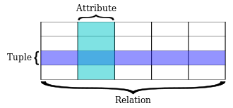

# Lecture 1
## Basic concepts of relation (database)

<a href="https://en.wikipedia.org/wiki/Relation_(database)">Check Wikipedia for more details.</a> 
  
> E. F. Codd used the term "relation" in its mathematical sense of a finitary relation, a set of tuples on some set of n sets S1, S2, .... ,Sn

